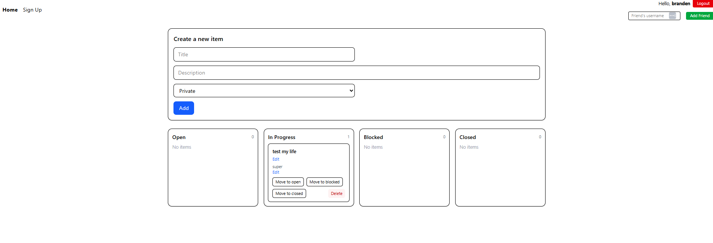
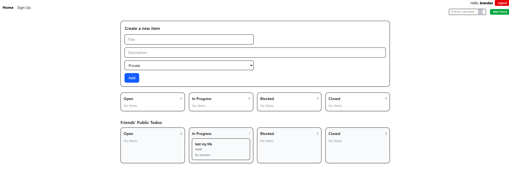
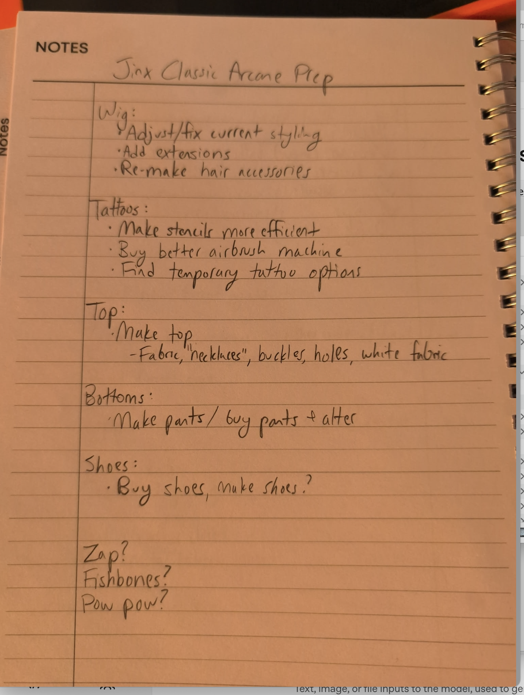

# Accountabilabuddy: Full-Stack Task Management Demo

Accountabilabuddy is a modern full-stack demo app for managing tasks and accountability with friends. It demonstrates best practices in React frontend development, Express backend APIs, and Turso (SQLite) database integration. The app is designed for learning and rapid prototyping, not production security.

---

## Architecture Overview

- **Frontend:** React + TanStack Router/Query + Shadcn UI + Tailwind CSS
- **Backend:** Express.js REST API
- **Database:** Turso (serverless SQLite)
- **Local SQLite Database:** A local SQLite database file (`mydb.sqlite`) is included in the project root. You can use this for local development, inspection, or migration. Export your Turso cloud database to this file using the Turso CLI for offline access.

---

## Frontend

- **React:** SPA with TanStack Router for file-based routing and layouts.
- **TanStack Query:** Handles all data fetching, caching, and mutations for todos, users, and friends.
- **Shadcn UI:** Beautiful, accessible components built on Radix UI and Tailwind CSS.
- **API Switching:** Easily toggle between a fake local API and the real backend using an environment variable (`VITE_USE_REAL_API`).
- **Authentication:** Signup, login, and logout flows. User state is managed in the frontend and passed to API calls.
- **Friend Management:** Add friends by username, view their public todos grouped by state (read-only).
- **Todos:** Create, edit, delete, and mark todos as public or private. Private todos are only visible to the owner.
- **Local Storage for Guests:** If you are not logged in, your todos are saved locally in your browser and will not sync across devices.
- **Theming Engine:** Switch between light and dark themes using the button in the header.
- **Routing:** All navigation and redirects handled by TanStack Router, including after login/signup/logout.

---

## Backend

- **Express.js:** RESTful API endpoints for users, login, todos, and friends.
- **Endpoints:**
  - `/healthz` (health check)
  - `/dbinfo` (sqlite / DB info)
  - `/api/users` (signup)
  - `/api/login` (login)
  - `/api/todos/:user_id` (list todos for a user)
  - `/api/todos` (create todo)
  - `/api/todos/:id` (patch/update todo)
  - `/api/todos/:id` (delete todo)
  - `/api/friends` (add friend)
  - `/api/friends/:user_id/todos` (get friends' public todos)
  - `/api/import-image` (upload an image / photo; forwarded to OpenAI to extract todos)

- **Logging:** Detailed request logging for debugging and development.
- **Error Handling:** Consistent error responses for failed requests.
- **Security:** Passwords are stored in plain text for demo purposes only. No session management or password hashing is implemented.

---

## Database (Turso / SQLite)

- **Schema:**

  | Table    | Columns                                                                                 |
  |----------|----------------------------------------------------------------------------------------|
  | users    | id (PK), username (unique), password                                                   |
  | todos    | id (PK), user_id (FK), title, description, state (open/in_progress/blocked/closed), visibility (public/private), createdAt, updatedAt |
  | friends  | user_id (FK), friend_user_id (FK)                                                      |

- **Best Practices:**
  - Foreign key constraints ensure data integrity.
  - Queries are parameterized to prevent SQL injection.
  - All data access is abstracted in `server/turso.js` for maintainability.
- **Why Turso?**
  - Serverless, fast, and easy to use for prototyping and edge deployments.
  - SQL is familiar and flexible for relational data.

---

## Environment Variables

Set these for real Turso connectivity (e.g. in Fly secrets or local .env):
- TURSO_URL
- TURSO_AUTH_TOKEN

If they are omitted the server now falls back to a local SQLite file `mydb.sqlite` (read/write) inside the container / project root so the app can still start for demo purposes.

---

## Demo Practices & Limitations

- **Authentication:** Login/logout is required to access personal and friends' data. No password hashing or session tokens—this is for demo only.
- **Friend System:** Add friends by username. You can view their public todos, but not private ones.
- **API Switching:** Use the fake API for local development, or connect to the real backend for full-stack testing.
- **No Production Security:** Do not use this codebase for sensitive data or production apps without adding password hashing, sessions, and proper validation.
- **Local Storage for Guests:** If you are not logged in, todos are saved locally in your browser and are not synced.
- **Theming Engine:** Easily switch between light and dark mode from the header.

---

## Usage Instructions

1. **Sign Up:** Create a new account with a username and password.
2. **Login:** Log in to access your dashboard.
3. **Add Todos:** Create todos and choose public/private visibility.
4. **Add Friends:** Enter a friend's username to add them. View their public todos grouped by state.
5. **Logout:** End your session and return to the home page.
6. **Switch Theme:** Use the button in the header to toggle between light and dark mode.

---

## Screenshots

### Dashboard


### Friend Management & Public Todos


*Add your own screenshots to the `public/` folder and update the filenames above as needed.*

---

## Image Import Demo

The repository includes a screenshot and a short screen recording that show the import-from-image flow:

- `public/example-image-import.png` — screenshot of the import UI and preview.
- `public/screenrecording.mov` — short recording showing selecting an image and creating todos.

Preview:



<video src="public/screenrecording.mp4" controls width="640">
</video>

How to run locally to reproduce the demo:

1. Start the backend and frontend locally:
   - Backend: `npm run backend`
   - Frontend: `npm run dev`
2. Or build/run the local Docker image (bundles `exported.sqlite`):
   ```bash
   docker build --target local -t accountabilabuddy:local .
   docker run --env-file .env -p 44000:44000 accountabilabuddy:local
   ```
3. Sign up or log in, go to the home dashboard, and use the "Choose Image / Camera" button to upload or take a picture. The app will send the image to the server, which forwards it to OpenAI to extract todos.

These demo files live in `public/` so they will be available in the built app and on GitHub when you view the repository.

---

## Getting Started

```bash
npm install
npm run dev
```

## Building For Production

```bash
npm run build
```

## Testing

```bash
npm run test
```

## Serve the backend
```bash
npm run backend
```

## Styling

Tailwind CSS is used for utility-first styling. Shadcn UI provides accessible, modern components.

## Linting & Formatting

```bash
npm run lint
npm run format
npm run check
```

---

## Learn More

- [TanStack Docs](https://tanstack.com)
- [Turso Docs](https://docs.turso.tech)
- [Shadcn UI](https://ui.shadcn.com)
- [Express.js](https://expressjs.com)
- [Tailwind CSS](https://tailwindcss.com)

---

## Docker — Local vs Production

This project includes two Docker build targets:

- `local` (bundles the local `mydb.sqlite` into the image) — useful for local development and testing.
  - Build local image (includes `mydb.sqlite`):
    ```bash
    docker build --target local -t accountabilabuddy:local .
    ```
  - Run local image (use your local `.env` for runtime configuration):
    ```bash
    docker run --env-file .env -p 44000:44000 accountabilabuddy:local
    ```

- `prod` (default) — does NOT include `mydb.sqlite` and expects production credentials (Turso, OpenAI) to be provided at runtime via environment variables or your hosting secrets manager.
  - Build production image:
    ```bash
    docker build -t accountabilabuddy .
    ```
  - Run production image (example passing required env vars):
    ```bash
    docker run -e TURSO_URL=... -e TURSO_AUTH_TOKEN=... -e OPENAI_API_KEY=... -p 44000:44000 accountabilabuddy
    ```
  - Or use an env file at runtime (recommended for local testing, not for CI/production):
    ```bash
    docker run --env-file .env -p 44000:44000 accountabilabuddy
    ```

Notes
- The `local` stage is intended only for local development. Do NOT bake secrets into images. Do not commit `.env` to version control.
- For Fly (or other platforms) set secrets via the platform tools (e.g. `flyctl secrets set OPENAI_API_KEY=... TURSO_AUTH_TOKEN=... TURSO_URL=...`).
- You can control whether the frontend connects to the real API at build-time using the build arg `VITE_USE_REAL_API`:
  ```bash
  docker build --build-arg VITE_USE_REAL_API=true -t accountabilabuddy .
  ```

---

## Next Steps / Final Notes

If we continue this project, recommended follow-up work includes:

- Real camera capture & improved UX
  - Replace the current snapshot/upload flow with a fully integrated camera capture experience (native getUserMedia with stream processing and a retake/confirm UI). Improve mobile browser compatibility and add overlays/guides for better photo capture quality.

- Session-based authentication
  - Move from the current in-memory query-based auth to a server-backed session system (HTTP-only cookies or JWTs) with proper session management, expiration, and CSRF protections for state-changing endpoints.

- Password security (hashing)
  - Do not store plaintext passwords. Use a proven hashing algorithm (bcrypt, argon2) on the server and store only the password hash. Update signup/login endpoints to use the hash and verify on login.

- Database schema & migrations
  - Update the users table to include a `password_hash` column (or rename the existing `password` column and backfill securely). Add a migrations system (e.g. simple SQL migration scripts or a tool like Umzug/migrate) so schema changes are tracked and can be applied safely across environments.

- Other improvements
  - Validate and sanitize OpenAI responses before creating todos (show a preview and require confirmation).
  - Move image uploads to multipart/form-data or cloud storage if images become large.
  - Add tests around the import flow, API endpoints, and auth flows.

These changes will make the app more secure, robust, and production-ready while keeping the current demo-friendly developer experience.

---

## Test Accounts

For convenience the following demo users exist in the remote database and can be used for quick sign-in during demos:

- username: `branden` — password: `ham`
- username: `brendan` — password: `ham`
- username: `philip` — password: `testpass`

These accounts are intended for development/demo purposes only. Do not use these credentials for any real accounts and do not expose them in production environments.

---

## Copilot for Readme
I enjoy using AI for documentation, keeps things fresh.
